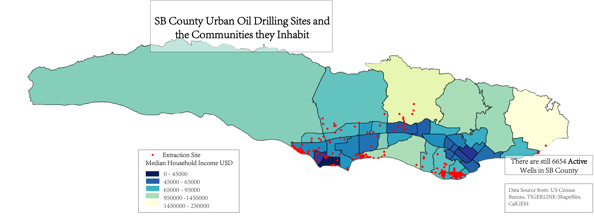
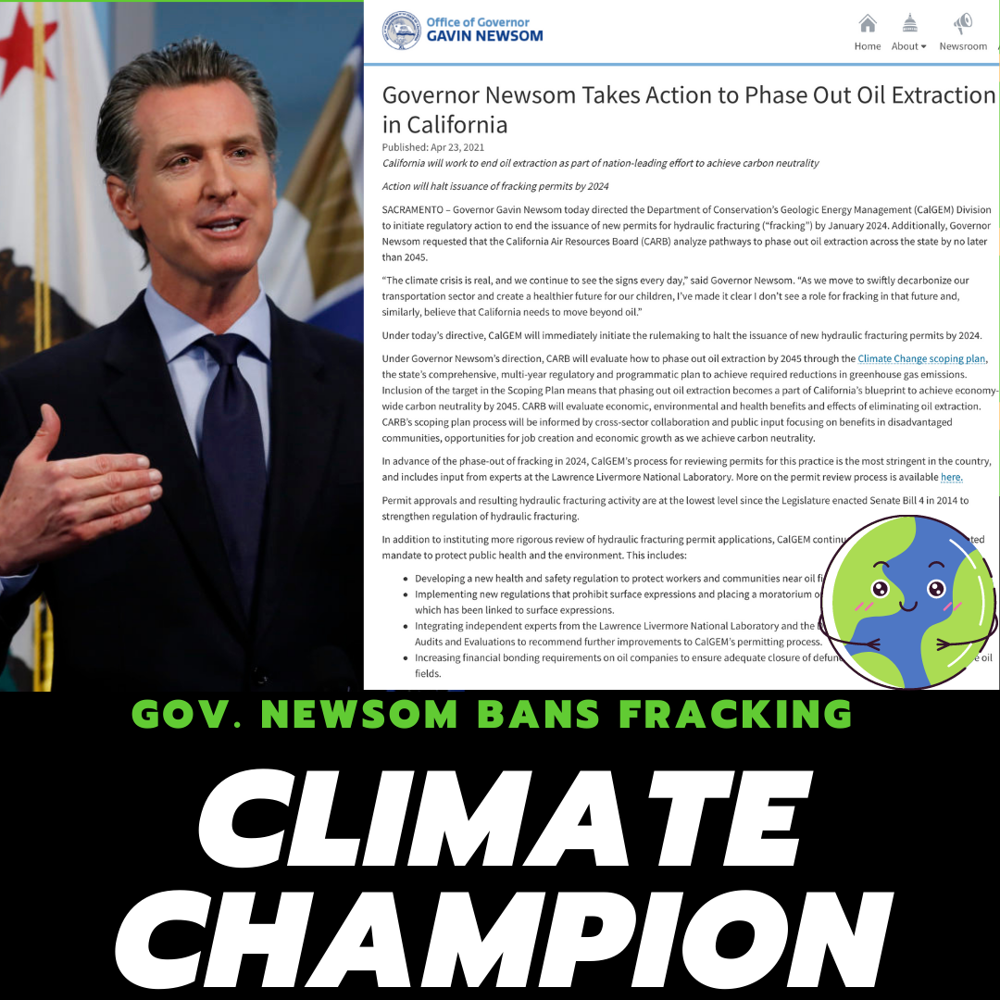

# CALPIRG: Ending Oil Drilling in Vulnerable Communities
Oil drilling in California disproportionately affects minority and low-income communities. Drilling sites are concentrated in these areas, leading to numerous harmful consequences such as:

- __Air and water pollution__: Contaminants from drilling operations pollute local environments.

- __Increased earthquake risk__: Fracking and drilling can destabilize fault lines.
  
- __Noise pollution__: Constant drilling creates high noise levels, disrupting communities.

While these communities bear the brunt of these negative impacts, they see little benefit from the energy produced. This creates a cycle of poverty and health issues that affects generations.

## Project Overview

This project aims to expose the correlation between oil drilling sites and regional demographics. We provide statistical analyses that reveal how oil drilling disproportionately impacts vulnerable populations.

## Data Sources

- Oil Drilling site data: [U.S.energy_adminstration](https://www.eia.gov/petroleum/drilling/)

- [united_census_bureau](https://www.census.gov/data.html)

The analysis is conducted on a county-by-county basis, with the full data and results available in this [shared_folder](https://drive.google.com/drive/folders/1hWEWJWHoTThoUTxZZ9bQ0v3mJsrEAPZN?usp=sharing)

## Visualizing the Impact
Below is a sample map showing the correlation between oil drilling sites in Santa Barbara County:

## Advocacy and Results

We presented our findings at a statewide event, advocating for policy changes to protect vulnerable communities from the harmful effects of oil drilling. You can view the presentation slides [here](presentation/presentation_slides.pptx).

As a result of our advocacy efforts, Governor Newsom announced a statewide ban on oil fracking and introduced zoning restrictions for new drilling sites. Victory!

