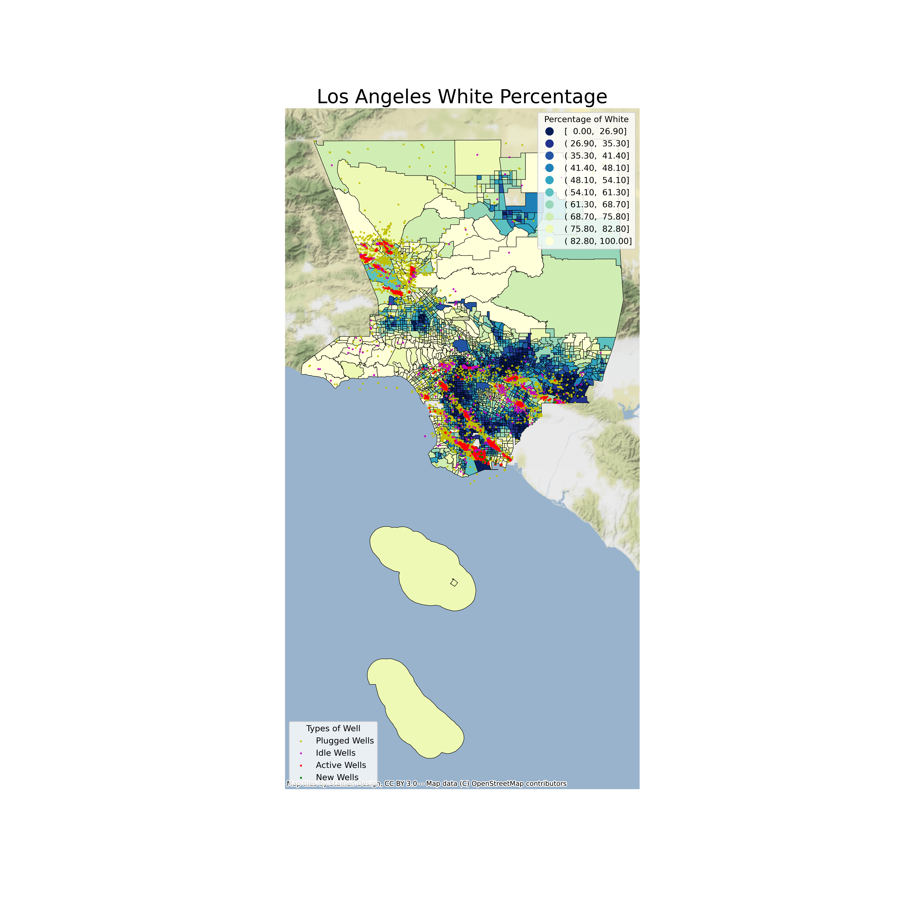

# CALPIRG END OIL DRILLING
Oil drilling sites in California has a uneven distribution across the state. Notably, the oil drilling sites are more dense in area where minority group and low-income family lives. Oil drilling impacts people live in numerous way. It include but not limited to the air and underground water pollution, increase in earthquake susceptibility and high noise level. While not sharing the benefit of the energy production, the poor and minorities are more vulnerable to the side effects and creating a proverty and health care trap that last generations.

In here, we speak with statistic and demonstrated that the correlation between oil dril sites and the regional demographic. The .gis data is from [U.S.energy_adminstration](https://www.eia.gov/petroleum/drilling/). The data for the demographic is from government census [united_census_bureau](https://www.census.gov/data.html). We analysis all distributions correlation by counties and it can be found in the following drive [shared_folder](https://drive.google.com/drive/folders/1hWEWJWHoTThoUTxZZ9bQ0v3mJsrEAPZN?usp=sharing).

Here are some maps that show distinctive correlation:

We present and advocate the in a state-wide event. The presentation can be found [here](presentation/Oil and Gas wells in California.pptx).

Later the year, governor Newsom annouce that to ban oil fracking and zone out area on oil drilling stie. Victory!
